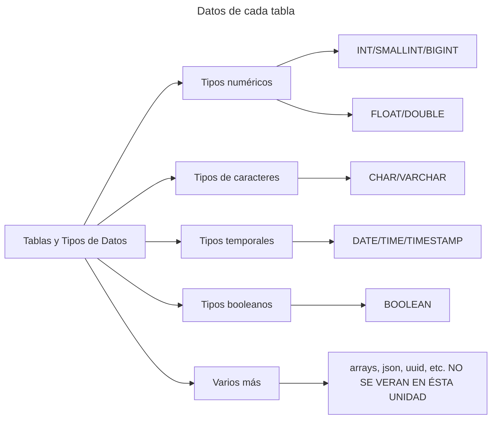

## Comandos para la base de datos

- ### Selecciones

  - `SELECT * FROM demo` Selecciona todo que este en la base de datos demo
    | Comando | Descripcion |
    | :------: | ------ |
    | `SELECT` | Indica que la consulta a realizar será de selección |
    | `*` | El asterisco es un comodín para indicar que se deben seleccionar todos los campos, o sea, todas las columnas de la tabla. |
    | `FROM` | Indica de qué tabla específica se va a seleccionar |
    | `demo` | Nombre de la tabla. En este caso esta viene precargada en sqliteonline |
    | `;` | Una consulta termina con un punto y coma, de esta forma podemos separar varias instrucciones. |

  - `SELECT NAME, ID FROM demo;` Solamente se va a centrar en traer la columna que nosotros le especifiquemos
    | Comando | Descripcion |
    | :------: | ------ |
    | `NAME` | Le estamos especificando que solamente vamos a querer el contenido de la columna **name** |
    | `NAME, ID` | Podemos traer más de una columna a la vez |

  - `SELECT * FROM demo WHERE ID >= 3;` Aquí va a traer todas las coincidencias donde el id sea mayor o igual a 2
    | Comando | Descripcion |
    | :-----: | ------ |
    | `WHERE` | **"Cuando"**. Dentro de la seleccion que realizamos vamos a ser más especificos con los datos que ingresen en la columna |

  - `SELECT * FROM demo LIMIT 3;` Limitamos el contenido a 3
    | Comando | Descripcion |
    | :-----: | ------ |
    | `LIMIT` | va a limitar el contenido traido desde la tabla a solo las primeras coincidencias dadas |

  - `SELECT * FROM demo ORDER BY name ASC;` Ordena los resultados por la columna **name** en orden ascendente. Paa hacerlo de forma Desentente se escribe `DESC`
    | Comando | Descripcion |
    | :------: | ------ |
    | `ORDER BY` | Ordena los resultados de la consulta según una o más columnas especificadas. |
    | `ASC` | Define el orden ascendente (de menor a mayor). Si no se especifica, ASC es el valor predeterminado. |
    | `DESC` | Define el orden descendente (de mayor a menor). |

  - `SELECT COUNT(*) FROM demo;` Cuenta el número total de registros en la tabla **demo**.
    | Comando | Descripcion |
    | :------: | ------ |
    | `COUNT(*)` | Devuelve el número de filas en el conjunto de resultados. |

  - `SELECT * FROM demo WHERE name LIKE 'l%';` Selecciona todos los registros donde la columna name comience con la letra "l".
    | Comando | Descripcion |
    | :------: | ------ |
    | `LIKE` | Busca un patrón específico en una columna. |
    | `'A%'` | Patrón que representa cualquier valor que comience con "A". % es un comodín que representa cualquier número de caracteres. |

  - `SELECT DISTINCT name FROM demo;` Selecciona solo valores únicos en la columna **name**.
    | Comando | Descripcion |
    | :--------: | ------ |
    | `DISTINCT` | Elimina valores duplicados del conjunto de resultados, mostrando solo valores únicos. |

- ### Insertando Datos

  - `INSERT INTO demo (NAME, HINT) VALUES ('Gonzalo', 'Pista 1');`
    | Comando | Descripcion |
    | :------: | ------ |
    | `INSERT` | Indica que vamos a insertar un dato |
    | `INTO` | Indica en qué tabla vamos a insertar |
    | `demo` | Es el nombre de la tabla en la que se insertarán los datos |
    | `(NAME, HINT)` | Los nombres de las columnas donde se insertarán datos |
    | `VALUES` | Indica que a continuación vamos a insertar valores |
    | `('Gonzalo', 'Pista 1');` | Los valores que estamos insertando, están en el mismo orden que las columnas, es decir, Gonzalo corresponde a name y 'pista 1' a Hint. |

- ### Actualizando Datos

  - `UPDATE demo SET HINT = 'High Priority' WHERE ID = 4;`
    | Comando | Descripcion |
    | :------: | ------ |
    | `UPDATE` | Indica que vamos a actualizar datos existentes en una tabla. |
    | `SET` | Especifica las columnas y los nuevos valores que se deben asignar. |
    | `HINT = 'High Priority'` | Establece el nuevo valor 'High Priority' en la columna hint para los registros seleccionados. |
    | `WHERE` | Especifica qué registros se deben actualizar. En este caso, solo aquellos donde el ID sea igual a 4. |

  - `UPDATE demo SET NAME = 'Performance Tuning' WHERE ID = 3;`
    | Comando | Descripcion |
    | :------: | ------ |
    | `NAME = 'Performance Tuning'` | Establece el nuevo valor 'Performance Tuning' en la columna name para los registros seleccionados. |

- ### Eliminando Datos

  - `DELETE FROM demo WHERE ID = 5;`
    | Comando | Descripcion |
    | :------: | ------ |
    | `DELETE` | Indica que vamos a eliminar datos existentes en una tabla. |
    | `FROM` | Especifica de qué tabla se eliminarán los registros. |
    | `WHERE'` | Especifica qué registros se deben eliminar. En este caso, solo aquellos donde el ID sea igual a 5. |

  - `DELETE FROM demo WHERE NAME = 'test';`
    | Comando | Descripcion |
    | :------: | ------ |
    | `WHERE NAME = 'test'` | Elimina todos los registros donde la columna name es igual a 'test'. |

> [!CAUTION]
> Jamás olvides poner el WHERE en el DELETE FROM!!!!!

## Comandos para crear, actualizar y eliminar tablas

